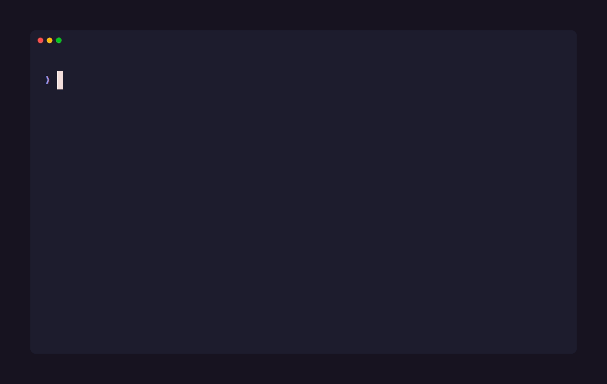

# NexusMem

[](https://github.com/yaminbkk/NexusMem/actions/workflows/ci.yml)
[](https://www.npmjs.com/package/nexusmem)
[](https://www.npmjs.com/package/nexusmem)
[](LICENSE)




Your coding agent can read `git log`. It cannot read the four things you tried last Tuesday that
didn't work.

NexusMem records what actually happened on your machine (shell commands and their exit codes, git
history down to the patch of each changed file, project docs, optionally your assistant transcripts)
into a local SQLite database, and
serves back a ranked, token-budgeted slice of it on demand. Everything stays on disk. No account, no
cloud, no telemetry.

The shell history is the part worth caring about. Git tells an agent what shipped. Shell history
tells it what was attempted, in what order, and which commands exited non-zero. That information
exists nowhere else, and it disappears when your terminal scrollback rolls over.

**Contents:** [Try it](#try-it) · [Exact shell capture](#optional-exact-shell-capture) ·
[Failure → fix chains](#failure--fix-chains-opt-in) · [How retrieval works](#how-retrieval-works) ·
[Session summaries](#session-summaries-optional-local-model) ·
[GitHub issues & PRs](#github-issues--prs-optional) · [Use it from an agent](#use-it-from-an-agent)
· [What it costs you](#what-it-costs-you) · [Staleness & provenance](#staleness--provenance) ·
[Where it breaks](#where-it-breaks) · [Commands](#commands) · [Cross-project recall](#recall-across-projects)
· [On disk](#on-disk) · [Development](#development)

## Try it

From inside any git repository:

```
npx nexusmem init
npx nexusmem sync
```

Then ask it something. Real output from this repository, top 2 of 5 hits:

```
$ nexusmem query "windows spawn failure"

Relevant history for: windows spawn failure

- 2026-08-09 [observed] fix: distinguish a failed git spawn from "not a git repository"
  readRepoInfo collapsed three unrelated failures into one error: git running and reporting
  the path is not a work tree, git not being installed, and the process failing to spawn at
  all. Dogfooding hit the third case in two separate sessions...
- 2026-08-09 [authored] README.md — Before a tagged release
  - [ ] Retry on transient process-spawn failures on Windows
```

`[observed]`/`[authored]` is the provenance tag (see [Staleness & provenance](#staleness--provenance))
— a commit is a directly observed event, a doc section is a written claim that could go stale.

A commit and a docs section, ranked against each other, inside whatever token budget you gave it.
Nothing was summarized by a model on the way out; the ranker just decided what not to send. (One
optional source, session summaries, does run a local model — but at ingest time, never on the way
out. What you query is always stored text.)

For a sense of what actually accumulates, here is `nexusmem status` on this repo after two days:

```
527 node(s)  2026-08-08 .. 2026-08-09
       321  shell_command
       130  conversation_turn
        60  doc_section
        16  git_commit
```

Sixteen commits. Three hundred and twenty-one shell commands. The commits were already retrievable
by any agent with a terminal. The rest was not.

That `conversation_turn` row only appears because this corpus was synced with `--conversation`.
Assistant transcripts are the one source that is off by default and stays off until you opt in, since
they are the likeliest place for a pasted credential to be sitting. A default install indexes git
commits, their diffs, shell and docs.

Requirements: Node 22 or newer, and git. Node 20 will not work, because `better-sqlite3` ships no
prebuilt binary for it and Node 20 went end-of-life in April 2026. Ollama is optional and only
affects semantic search (see below).

## Optional: exact shell capture

Scraped history files (PSReadLine, `.bash_history`, `.zsh_history`) give you command text and not
much else. The hook gives you working directory, exit code and a real timestamp:

```bash
nexusmem hook install
```

It wraps your existing PowerShell prompt rather than replacing it, is idempotent, and
`nexusmem hook remove` undoes it cleanly.

Exit codes are what make this worth installing. A failed command is a stronger signal than a
successful one, and without the hook there is no way to tell them apart.

## Failure → fix chains (opt-in)

```bash
nexusmem sync --link-failures
```

After a normal sync, this walks every failed `shell_command` (non-zero exit code) and looks for
whatever later resolved it, using two independent heuristics: a later command in the same project
and working directory, exact same normalized text, that exited `0` within 24h (**same-command
retry**); and, separately, the best full-text match among nearby conversation turns or session
summaries, requiring every significant word of the failing command to appear, not just one
(**conversation bridge**). A failure can be linked by either, both, or neither.

Both links are surfaced in query results. The conversation-bridge heuristic originally matched on
any shared word, and dogfooding against this repo's own real history found it wrong on roughly half
its links — a shared word as generic as "npm" was enough to link an unrelated discussion. Requiring
every significant word fixed that: re-dogfooded against the same corpus, every resulting link (the
full set produced, not a sample) checked out correct on manual review of the full text, not just the
summary.

When a linked failure appears in a result set, its fix rides along immediately after it, inheriting
the failure's own relevance score rather than needing to match the query on its own merits. That is
the point: a query about why something failed shouldn't need to separately guess the words used in
whatever fixed it. This works across projects too — `query --all-projects` chains a failure to its
fix using whichever project's own database recorded the link, since links are always local to the
project they were found in.

```
$ nexusmem query "why did npm whoami fail"

- 2026-08-12 [observed] shell: npm whoami  (exit 1)
- 2026-08-12 [observed] shell: npm login   (exit 0)  -- linked as the fix
```

## How retrieval works

Every source normalizes to the same `MemoryNode` shape, so a commit, a shell command and a docs
section compete on equal terms. Retrieval runs BM25 over FTS5 and, if an embedding model is
reachable, a vector search over `sqlite-vec`, fused with Reciprocal Rank Fusion on rank *position*
only, never raw scores — a BM25 cost and a vector distance live on unrelated, unbounded scales, and
position is the only thing they agree on.

Ranking then multiplies three factors:

```
score = relevance × signal^0.215 × recency^0.288
```

`relevance` comes from the query. `signal` (a `fix:` commit outranks a `chore:`; a failed command
outranks a successful one) and `recency` are priors that hold before any query exists. Each factor is
floored into `[floor, 1]` rather than `[0, 1]`, so one weak dimension can't zero out a strong match.

The exponents bound how far signal and recency, *together*, may overturn relevance: at most a 2× gap
across their whole range, applied jointly rather than per-prior. That's deliberate — the score
*multiplies* the two priors, so capping each at 2× separately still let the pair overturn 4×, and
that hit hardest on fresh, high-signal commits made during an active working day. The bug that
exposed this: two unrelated same-day `fix:` commits outranked the docs section that actually answered
the query. See [`retrieval/rank.ts`](src/retrieval/rank.ts) for the full derivation.

Without Ollama, vector search is skipped and you get BM25 only — fully supported, not a degraded
state; `sync` and `query` both succeed and simply do less.

## Session summaries (optional, local model)

With `sources.session.enabled`, each finished session becomes one distilled node next to the raw
exchanges — what was decided and why, rather than forty individual turns. It runs a local Ollama
chat model (`qwen2.5:3b` by default); nothing is downloaded automatically and nothing leaves the
machine.

```bash
nexusmem scan-session --dry-run
```

That prints the exact prompt a session would produce, after redaction and budget trimming, without
calling the model.

Three things bound the cost. A session is only summarized once it has been quiet for
`settleMinutes` (default 30), so a session in progress is not re-summarized on every sync. The
prompt is hashed, and an unchanged hash skips the model entirely — on this repo a steady-state sync
of 14 summarized sessions takes 0.25s and makes no model calls. And `maxSessions` (default 10) caps
how many reach the model per run; the rest are reported as queued and picked up next sync.

**What it is actually like, measured on 14 real sessions with `qwen2.5:3b`.** The summaries
themselves are good: decisions with their reasons, in the shape the prompt asks for. Titles are less
reliable — the model returned a usable one about a third of the time, and otherwise produced a
conversational preamble, a stray bullet, or a bare "Summary of the Session". Those are rejected and
the title falls back to the first line of the question that opened the session, which is always
specific even when it is not elegant. Compliance was worst on long sessions and on transcripts not
in English. A larger model (`qwen2.5:7b`) is the lever if the titles matter to you; set
`sources.session.model`.

## GitHub issues & PRs (optional)

With `sources.github.enabled`, each issue and PR on this repo's github.com remote becomes one node
(title, opening post and every comment, folded together) alongside the raw discourse a discussion
already leaves in shell/conversation history. Off by default — not for a sensitivity reason, but
because it's the first source with a real external dependency: it reads via the `gh` CLI, so it
needs `gh` installed and authenticated (`gh auth login`), and it makes live network calls instead of
only reading what's already on disk. A repo with no github.com remote, or an unauthenticated `gh`,
is a silent no-op either way.

```bash
nexusmem scan-github
```

previews the nodes a sync would produce, same as the other `scan-*` commands. `maxThreads` (default
100) and `maxCommentsPerThread` (default 100) bound one sync's cost; `since` is tracked as its own
cursor, so a repeat sync only re-reads threads that changed. Dogfooded against this repo's own 14
real issues/PRs: ingest took under a second, and a query for "labelled retrieval regression corpus"
correctly ranked issue #8 — the one that asked for it — first.

## Use it from an agent

```json
{
  "mcpServers": {
    "nexusmem": {
      "command": "npx",
      "args": ["-y", "nexusmem", "mcp"]
    }
  }
}
```

Three tools over stdio: `search_memory` returns the packed context block, `sync_project` ingests, and
`get_status` reports what is currently remembered. Each takes an explicit `projectRoot`, because an
MCP tool call carries no shell working directory. `sync_project` runs `init` for you if the
repository has not been set up.

## What it costs you

Two numbers get conflated in tools like this, so they are kept apart here.

**Packer efficiency** is how much the ranker trims from its own candidate set. On this repository's
corpus it runs 81–84%. It is useful for tuning the ranker and useless as a claim about your bill,
because the baseline is hypothetical: without NexusMem those candidates were never going into your
context window in the first place.

**End-to-end saving** compares the packed context NexusMem actually sends against reading, in full,
the same files its own ranking identified as relevant to the query. Measured with
[`scripts/benchmark.ts`](scripts/benchmark.ts) (`npm run bench`), which anyone who clones this repo
and points it at a synced corpus can re-run from scratch:

| Corpus | Commits | Query set | vs. full file content | vs. `git log -p` on those files |
| --- | --- | --- | --- | --- |
| This repo | 62 | 16 real prompts, verbatim from this project's own history | 95% (median 94%) | 98% (median 97%) |
| [`vitejs/vite`](https://github.com/vitejs/vite) | 9,567 | 16, mechanically sampled — see below | 99% (median 98%) | ~100% (median ~100%) — see caveat |

Both clear the original >70% target ("cut API token spend versus sending full context"), and the vite
run is the first measurement at the scale that target was always described as applying to.

**Read the methodology before quoting either number — it's a narrower claim than it looks:**

- **Graded against NexusMem's own ranking**, not an outside answer key: the file set is whichever
  files the packed nodes for that query touch. This measures what the pack step saves once retrieval
  already picked a candidate set; it doesn't independently verify that set was the right one.
- **Query sets are mechanical, not cherry-picked** (see `scripts/benchmark.ts`): vite's is an even
  sample of well-explained `fix`/`feat`/`perf`/`refactor` commits plus rationale-bearing doc headings;
  this repo's reuses real historical prompts verbatim, several of which are broad task instructions
  rather than narrow questions — part of why its number sits below vite's.
- **`git log -p` baselines can be enormous** — one vite query's baseline hit 7.5M tokens because a
  file in its resolved set has that much history. At that scale, "just read the file's history
  instead" stops being a viable alternative at all.
- **Supersedes the old ~40% figure**, which was hand-tallied from two hand-picked queries against
  this repo alone with an unstated baseline. Not wrong, just underspecified — this replaces it with a
  stated method and a script that reproduces it.

One thing that is not a percentage: shell commands and conversation turns have no cheap `grep`
equivalent. Without something recording them, they are gone, not merely more expensive to find.

For how these numbers compare to a similar tool's own claims, see
[`docs/competitor-comparison.md`](docs/competitor-comparison.md) (vs. projectmem) and
[`docs/competitor-comparison-yesmem.md`](docs/competitor-comparison-yesmem.md) (vs. YesMem, including
native Windows support vs. its documented WSL2 requirement).

Latency on a ~530-node corpus, warm, p50 over 10 runs:

| Operation | |
| --- | --- |
| BM25 retrieval (FTS5) | ~1.1 ms |
| Vector KNN (`sqlite-vec`) | ~3.2 ms |
| Fuse, rank, pack | ~0.6 ms |
| Query embedding (local Ollama) | ~55–77 ms |
| **End-to-end hybrid** | **~56 ms** |

All the SQLite work totals about 5 ms. The embedding call is the only thing on this path worth
optimizing, and it is somebody else's process.

## Staleness & provenance

Two things a memory layer needs and this one only partly has: a way to tell an observed fact from a
guess, and a way to retire a conclusion once something contradicts it. This section is what exists
and what doesn't.

Every node carries a `provenance`, a four-tier trust hierarchy set once per collector at ingest
time: `observed` (a commit that landed, a shell command's real exit code) > `authored` (a doc
section — a human's own written claim) > `recorded` (a conversation turn — verbatim, but talk about
events rather than the events) > `derived` (a session summary — a model's distillation). The tier is
shown as a tag on every query result and decays retrieval weight — the lower the trust, the faster a
node fades from ranking as it ages. The ordering is the design claim; the exact decay ratios are
judgment calls, not measured optima.

```bash
nexusmem stale
```

Lists non-`observed` nodes old enough (45+ days by default) that nothing has confirmed they still
hold — a heuristic on age and provenance, not on content. It writes nothing; you decide which
candidates are actually wrong. Any candidate the SLM has already flagged (see below) is decorated
with its standing `likely superseded by` suggestion — reading those costs nothing, so the plain
command stays instant and offline.

```bash
nexusmem mark-stale <oldNodeId> --supersedes <newNodeId>
```

Links `newNodeId` as the replacement for `oldNodeId`. The ranker down-weights the old node from then
on (it stays queryable, just usually loses to its replacement) — nothing is deleted, unlike `forget`.

```bash
nexusmem stale --check-contradictions
```

For each candidate, finds the most similar newer node (local embedding search) and asks a local SLM
(Ollama, `qwen2.5:3b` by default) whether it actually contradicts the older one — real content
comparison, not just age. A match is printed as `likely superseded by <id> <title> -- <reason>`
under the candidate. Every judgment (either verdict) is memoized, so a judged pair is never sent to
the model again; nothing else is written — `supersedes` stays yours to set via `mark-stale`.

**This also runs automatically during `sync`** — at most 3 new judgments per run (configurable via
the `contradictions` block in `.nexusmem/config.json`; set `autoCheck: false` to turn it off), only
when the embedding provider was reachable anyway, and free on repeat syncs thanks to the
memoization. New and open suggestions show up in the sync summary, `nexusmem status` (a `flagged`
line), and plain `nexusmem stale`.

**What this doesn't do:** it is one small model's yes/no judgment on one older/newer pair, not a
verified fact — treat a match as a lead to check, not a conclusion. It also only ever compares a
candidate against nodes *found by embedding similarity*; a contradiction from an unrelated-sounding
node would never surface. Comprehensive contradiction detection (not just for the pair the vector
search happens to surface) is still an open problem, and nothing here supersedes a node on its own.

`provenance` is a separate question from `trust_state`: provenance says where a claim came from,
never whether anyone checked it.

```bash
nexusmem review <nodeId> --verify
nexusmem review <nodeId> --reject
```

Records your own verdict on one node, independent of the SLM contradiction checker above (which only
ever writes a suggestion, never a verdict). `--reject` down-weights the node in ranking — same
demote-not-delete rule as `mark-stale`, it stays queryable, just usually loses to better matches —
and both verdicts are shown as a `[verified]`/`[rejected]` tag on every query result that returns the
node afterward. `--verify` is a label only; it does not boost ranking. Every node starts `candidate`
(untagged) until reviewed, and a re-sync never overwrites a verdict once one is set.

## Where it breaks

- **Shell history without the hook is unscoped.** Scraped history has no directory context, so it is
  attributed to whichever repository you ran `sync` from. Bounded to a tail window, and an
  approximation rather than a guarantee.
- **Japanese and Chinese depend on the vector pass.** FTS5's `unicode61` tokenizer splits on
  whitespace, so languages without space boundaries get no useful BM25 recall.
- **Rebasing strands nodes.** Rewritten history leaves nodes for unreachable commits. They describe
  real events so they are not wrong, but a targeted prune does not exist yet. `sync --rebuild`
  forces a clean re-scan.
- **Multi-line PowerShell input is read as separate commands.** A function typed across several lines
  at the prompt is not reconstructed.
- **Scrape-fallback ids drift** if the history file is trimmed from the front between syncs.
  Installing the hook fixes this.
- **Session-summary titles depend on the model following instructions**, and a 3B model often does
  not. The fallback keeps them specific rather than generic, but see the section above for what to
  expect.
- **Changing the embedding model re-embeds everything.** Vectors from two models are not comparable
  and `nodes_vec` records no per-row provenance, so `sync` drops the lot and rebuilds rather than
  ranking across a mixture. It says so when it happens. Nodes are untouched and BM25 keeps working
  throughout.
- **Diff indexing is bounded, and deliberately lossy.** A first sync indexes the patches of the most
  recent 200 commits (later syncs only walk `cursor..HEAD`); merge commits contribute none, since
  their patch exists only in a combined format this parser does not read; and binaries, lockfiles and
  build output are skipped so a dependency bump cannot bury the corpus. All of it is still recorded
  as a `git_commit` node. A patch longer than `limits.maxBodyChars` is truncated, so the tail of a
  very large change is not indexed. The caps live under `sources.diff` in `config.json`.
- **Cross-project recall favours breadth.** Each repository's hits are fused by rank, so a project
  whose best match is mediocre still contributes a rank-1 item, and rank 1 is worth the same in
  every list. Adding a repository that has little to say about your question still pushes a few of
  its results into the budget. Signal, recency and the budget are what hold that in check; there is
  no per-project quality weight.
- **The project registry is an index, not a source of truth.** It can point at a database that has
  moved or been deleted; those are reported and skipped, never silently pruned, because an
  unmounted drive is not a deleted project.
- **Conversation chunking is unevaluated.** Splitting long replies at heading boundaries measurably
  helped, but it has never been tested systematically.
- **A chunked node's sibling count in one result is capped, not tuned.** `conversation_turn` and
  `doc_section` both split one reply or file into several nodes; at most 2 of them may appear
  together in a packed result. Found live: a query for "token" returned 9 of its top 12 hits as
  different pieces of one heavily-sectioned reply, crowding out the node that actually answered it.
  The cap of 2 is a judgement call, not a measured optimum, same as the ranking priors' budget above.
- **The size of the prior budget is a judgement call, not a measured optimum.** Priors are now
  bounded jointly rather than one at a time, which closed a real 4× hole (see the ranking section),
  but the 2× budget itself has never been tuned against a labelled relevance set — there isn't one.
  It is a defensible constant, not a result. What is measured is the direction: on four real queries
  against this repo's own memory, switching to the joint cap moved the section that answered the
  question up in three of them (the rationale section for "why BM25 before vector search" went from
  rank 4 to rank 1) and displaced no query's correct top hit.
- **`forget` is per-repository, not global.** Its deny-list lives in the one `.nexusmem/memory.db` it
  ran against (plus that repo's stale prior identities, same scope `--prune-source` already uses). A
  value that leaked into shell history from several repositories needs `forget` run once per repo —
  there is no shared, machine-wide deny-list across every project you have synced.
- **A deny-list doesn't survive a clone or restore on its own.** `.nexusmem/` is gitignored by design,
  so `deny_list` never travels with `git clone`/`git push` — while git history itself, the thing a
  fresh `sync` re-derives from, is fully portable and copied by every clone. A teammate's fresh
  checkout, a new machine, or a restored backup starts with zero protection: the forgotten value comes
  right back on the first sync. Confirmed live 2026-08-17, not just a theoretical read of the code.
  `forget --export <path>` / `forget --import <path>` close this: export writes the active entries to
  a plaintext JSON file you move through a channel you control (never git — the file is exactly as
  sensitive as the value it holds), and import re-applies them in the new checkout, deleting any
  copies that already synced back in. It is deliberately manual, not automatic on every `sync`.

## Commands

`init`, `sync`, `query <text>` (add `--as-of <date>` for a bi-temporal read, see below), `status` (add
`--share` for a plain-text summary worth pasting somewhere), `projects`, `mcp`, `forget <value>`,
`stale` (add `--check-contradictions` for a local-SLM content check, see above), `mark-stale
<nodeId> --supersedes <newNodeId>`, `review <nodeId> --verify|--reject` (record a human verdict on
one node, see above), `precheck` (advisory — warns about staged files with an unresolved past
failure or high recent churn; exits 0 unless `--strict`), `hook install|remove|status` (the
PowerShell exit-code hook), and `hook git install|remove|status` (a git pre-commit hook that runs
`precheck` before each commit).

There are also seven dry-run previews (`scan-git`, `scan-diff`, `scan-shell`, `scan-docs`,
`scan-conversation`, `scan-session`, `scan-structure`) that write nothing and print what ingestion
*would* produce — nodes and their signal scores for the first six, import-graph edges for
`scan-structure`. That is the intended way to tune scoring against a real repository before
committing to a change. Add `--json` to pipe them somewhere.

Every command takes `-C <path>` to target another repository. On `sync`, `--conversation` opts the
transcript source in for one run without persisting it, `--no-embed` skips the vector pass,
`--link-failures` builds the failure → fix chains described above, and `--rebuild` drops the
project's nodes and re-ingests from scratch.

`sync --prune-source <name>` deletes an entire collector source (e.g. `shell:pwsh`); `forget <value>`
is the finer-grained complement — it deletes every node matching one exact string (or `--regex`
pattern) *and* writes a standing deny-list entry so the value can never be re-ingested, even by a
later `sync --rebuild` re-reading the append-only shell-hook log or a full transcript scan. Every
removal leaves a hash-only tombstone, never the forgotten content itself. Both are dry-run by
default; `--yes` confirms. `forget --list` shows active entries; `forget --export <path>` /
`forget --import <path>` carry them to another checkout of the same repo (see the limitation above).
See [`docs/forget-mechanism.md`](docs/forget-mechanism.md) for why this exists.

## Recall across projects

`query --all-projects` searches every repository you have run NexusMem in, not just the current one,
and tags each result with the repository it came from:

```
$ nexusmem query --all-projects "why was the retry budget raised"
scope   2 project(s): NexusMem, uploader

- 2026-08-12 [observed] [uploader] fix: raise the retry budget after the S3 upload timeouts
- 2026-08-12 [observed] [uploader] retry.ts @ 8d0f98b — fix: raise the retry budget after the S3 upload timeouts
  @@ -1 +1 @@
  -export const RETRY_BUDGET = 3;
  +export const RETRY_BUDGET = 5;
- 2026-08-09 [observed] [NexusMem] fix(git): retry a transient failure to spawn git
```

## Bi-temporal reads

Every node carries two clocks: `ts`, the event's own time ("what happened then"), and `created_at`,
the moment the store actually recorded it ("what did the store hold then") — normally the same
question, but not when a sync runs late, a backfill lands weeks after the events it describes, or a
teammate's clone catches up all at once. `query`/`search_memory` answer the first by default;
`--as-of <date>` switches to the second:

```bash
nexusmem query "why does the ranker cap joint priors" --as-of 2026-08-10
```

Only nodes recorded at or before that instant are considered, even if the events they describe are
older still. There is no equivalent write — this is a read-time filter over `created_at`, not a
snapshot or a way to query a value that has since changed, since nodes are write-once (see
[Staleness & provenance](#staleness--provenance) for what changes a node's *weight*, not its
record).

Databases stay per-repository — there is no shared global store, and deleting one repo's
`.nexusmem/` still removes exactly that repo's memory. What makes the others findable is a plain
index at `~/.nexusmem/projects.json`, written by `init` and refreshed by every `sync`. `nexusmem
projects` shows what is in it, and `--prune` forgets entries whose database is gone.

Ranking across repositories uses reciprocal rank fusion per project rather than raw BM25, because a
BM25 cost is computed against its own corpus and means different things in a 50-node and a
50,000-node database. The trade is stated in *Where it breaks*.

The MCP `search_memory` tool takes the same switch as `allProjects: true`.

## On disk

```
<repo>/.nexusmem/
  .gitignore     '*' — the workspace ignores itself, so init never edits a file it doesn't own
  config.json    validated on read; a corrupt config fails loudly rather than silently
  memory.db      SQLite in WAL mode

~/.nexusmem/
  projects.json      which repositories exist, for cross-project recall; a corrupt one reads as empty
  shell-history.jsonl  the hook's log, if you installed it
```

`NEXUSMEM_HOME` overrides the user-scoped directory.

Node ids are content-addressed from `sha256(projectId + kind + naturalKey)`, so running `sync` twice
cannot produce duplicates and ingestion stays correct even if a cursor is lost. Project identity
comes from the normalized origin URL when there is one, falling back to the absolute path, so two
clones of the same repo share one memory namespace.

Deleting `.nexusmem/` loses nothing that `sync` cannot rebuild.

## Status

Ingestion, hybrid retrieval, budgeted packing and the MCP server all work and are covered by 701
tests running on Linux and Windows across Node 22 and 24.

## Development

```bash
npm install
npm run typecheck
npm test
npm run build
```

Tests are behavioral rather than snapshot-based, and several are regressions tied to specific
observed failures. `tests/git-errors.test.ts` injects a fake `spawn` to exercise the Windows
process-spawn faults, which cannot be provoked on demand.

## On how this was built

This started as an experiment in whether a local context-memory engine for coding agents was viable,
prototyped with Claude Code. The code was written through AI-assisted workflows; the architecture,
the design decisions and the specifications were human-directed.

That is worth stating plainly because it should change how you read the code, not whether you trust
it. Audits, corrections and PRs are genuinely welcome, and the commit history is deliberately
detailed about *why* things are the way they are, including the times an earlier assumption turned
out to be wrong.

## License

MIT
